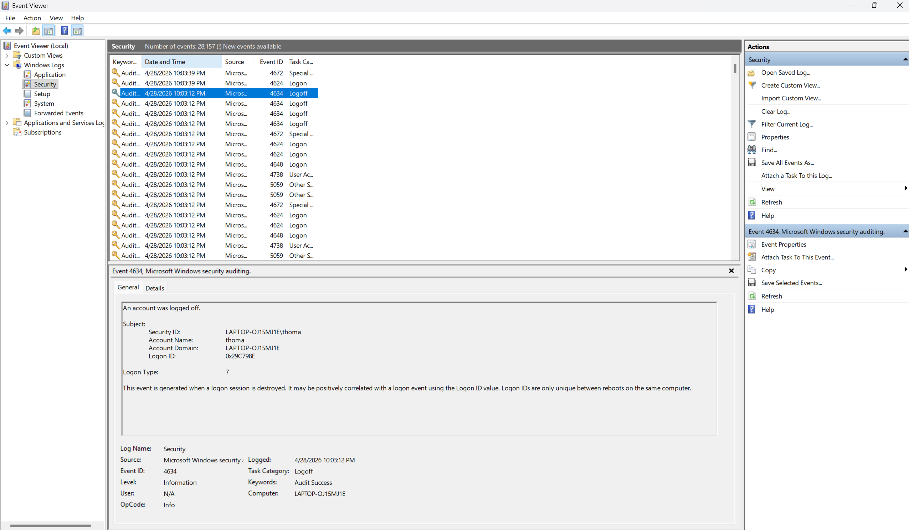
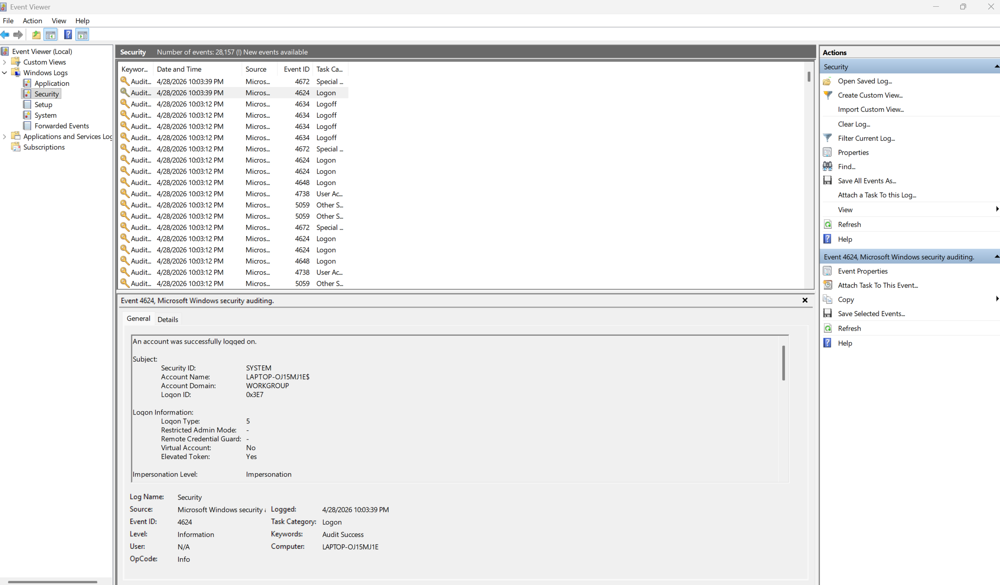
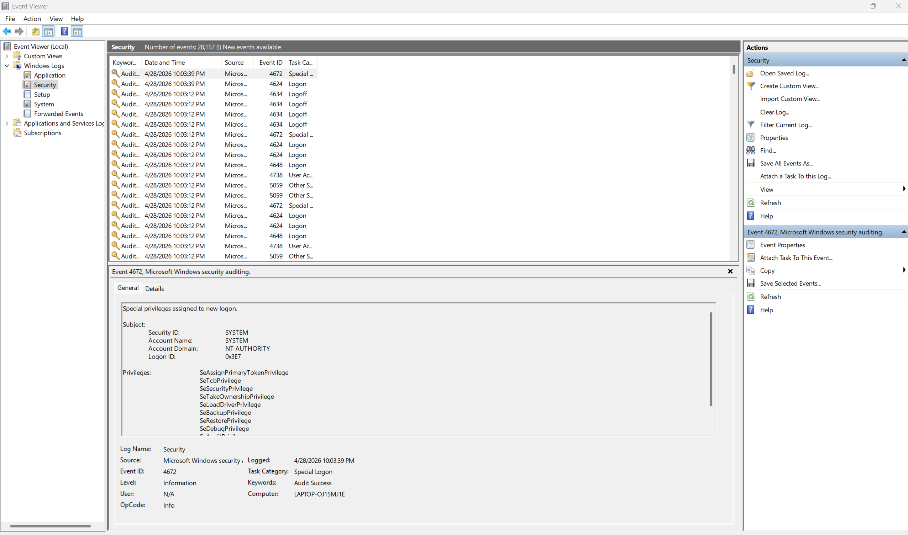

# Windows-Authentication-Log-Analysis
## Overview
This project analyzes Windows Security logs using Event Viewer to identify authentication activity and understand system behavior.

## Objective
The goal of this lab was to review Windows Security events, identify key authentication-related Event IDs, and document findings like a beginner SOC analyst.

## Tools Used
- Windows Event Viewer
- Windows Security Logs
- Windows Home Edition

## Event IDs Analyzed

| Event ID | Event Name | Meaning |
|----------|------------|--------|
| 4624 | Successful Logon | A user or system account successfully logged in |
| 4634 | Logoff | A user session ended |
| 4672 | Special Logon | Special privileges assigned to a logon |

## Findings
- Observed successful logon events (Event ID 4624)
- Observed logoff/session ending activity (Event ID 4634)
- Identified privileged logon events (Event ID 4672)
- Determined that SYSTEM-level processes generate elevated privilege logons
- Attempted to generate failed logon events (4625), but they were not present

## Analysis
The logs showed a normal authentication sequence:
- Logoff event occurred when the system was locked
- Logon event occurred when the user signed back in
- A privileged logon event followed, indicating system-level activity

## Key Takeaways
- Windows logs track authentication activity through Event IDs
- Privileged logons (4672) are common for system processes
- Not all logs (like failed logons) appear on Windows Home edition
- Analysts must work with available data and interpret system behavior

## Skills Demonstrated
- Log analysis
- Security event interpretation
- Authentication monitoring
- Cybersecurity fundamentals

## Screenshots
### Security Log Overview

### Successful Logon Event (4624)

### Special Logon Event (4672)

